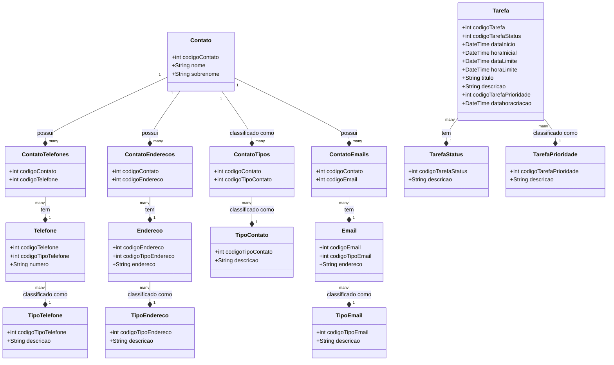

Diagrama Classe
===

```mermaid
classDiagram
    class Contato {
        +int codigoContato
        +String nome
        +String sobrenome
    }

    class Telefone {
        +int codigoTelefone
        +int codigoTipoTelefone
        +String numero
    }

    class TipoTelefone {
        +int codigoTipoTelefone
        +String descricao
    }

    class ContatoTelefones {
        +int codigoContato
        +int codigoTelefone
    }

    class ContatoEnderecos {
        +int codigoContato
        +int codigoEndereco
    }

    class TipoContato {
        +int codigoTipoContato
        +String descricao
    }

    class ContatoTipos {
        +int codigoContato
        +int codigoTipoContato
    }

    class Tarefa {
        +int codigoTarefa
        +int codigoTarefaStatus
        +DateTime dataInicio
        +DateTime horaInicial
        +DateTime dataLimite
        +DateTime horaLimite
        +String titulo
        +String descricao
        +int codigoTarefaPrioridade
        +DateTime datahoracriacao
    }

    class TarefaStatus {
        +int codigoTarefaStatus
        +String descricao
    }

    class ContatoEmails {
        +int codigoContato
        +int codigoEmail
    }

    class TipoEndereco {
        +int codigoTipoEndereco
        +String descricao
    }

    class TarefaPrioridade {
        +int codigoTarefaPrioridade
        +String descricao
    }

    class Endereco {
        +int codigoEndereco
        +int codigoTipoEndereco
        +String endereco
    }

    class TipoEmail {
        +int codigoTipoEmail
        +String descricao
    }

    class Email {
        +int codigoEmail
        +int codigoTipoEmail
        +String endereco
    }

    Contato "1" --* "many" ContatoTelefones : possui
    ContatoTelefones "many" --* "1" Telefone : tem
    Telefone "many" --* "1" TipoTelefone : classificado como
    Contato "1" --* "many" ContatoEnderecos : possui
    ContatoEnderecos "many" --* "1" Endereco : tem
    Contato "1" --* "many" ContatoTipos : classificado como
    ContatoTipos "many" --* "1" TipoContato : classificado como
    Contato "1" --* "many" ContatoEmails : possui
    ContatoEmails "many" --* "1" Email : tem
    Email "many" --* "1" TipoEmail : classificado como
    Endereco "many" --* "1" TipoEndereco : classificado como
    Tarefa "many" --* "1" TarefaStatus : tem
    Tarefa "many" --* "1" TarefaPrioridade : classificado como
```
